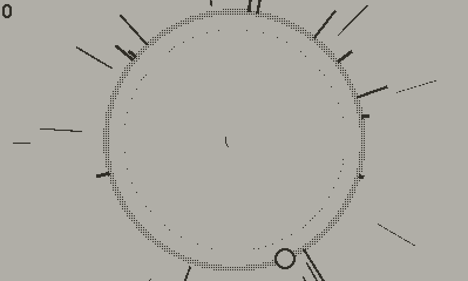

# 
#### A crank-based space-themed rhythm game.

Orbeats is an archetypal rhythm game for the PlayDate created by [Palette](https://github.com/paletteheart). It’s made to be infinitely expandable with user-made levels, and simple to grasp but hard to master. You control a cursor with the crank and hit incoming notes with the buttons.

## Sideloading
If you want to sideload the game onto your PlayDate, download the latest release [here](https://github.com/paletteheart/Orbeats/releases). Then go to [play.date/account/sideload](https://play.date/account/sideload) and upload the .pdx.zip to it. Then on your PlayDate, go to `Settings → Games`, and it should refresh and give you the option to download Orbeats.

Alternatively, you could sideload it through the PlayDate Simulator, which you can get in the SDK [here](https://play.date/dev/). You’ll want to go to where you installed the SDK, then to `\PlaydateSDK\Disk\Games`, and put the .pdx there. Then, plug your PlayDate into your computer and unlock it. Open the simulator, open Orbeats, and then press `Alt-U` to upload to your PlayDate.

## Creating User Levels
Orbeats was built with user-created levels in mind. Currently, there is no available editor to work with, but there are a couple being worked on at the moment, one that will be available in-game, and a likely more powerful one for Windows.
For now, if you’re really determined to create a level, check out the [Map Documentation](https://github.com/paletteheart/Orbeats/blob/main/Map%20Documentation.md), it should give you all the information you need to begin creating levels by hand.

## Playing User Levels
If you want to play user-created levels, you’ll need to manually put them on your PlayDate. To do this, plug your PlayDate into your computer. Go to `Settings → System → Reboot to Data Disk`, and then you should be able to access the PlayDate’s files from your computer. Go to `PLAYDATE\Data\com.paletteheart.orbeats\songs`. If the `songs` folder doesn’t exist, just create it. In there you’ll put the folders for any user songs. Then, eject your PlayDate, and when you next launch Orbeats the user songs should show up in the song list.

## Credits
- Libraries
	- [PdParticles - PossiblyAxolotl](https://github.com/PossiblyAxolotl/pdParticles)
- Music Donated By
	- Alaska Sargent
	- Dawn of Apples
	- keyesgen
	- Marilette’s Aphrodite
	- Rupert Cole
	- Uhrwerk Klockwerx
	- Wyvren
	- Zane Little